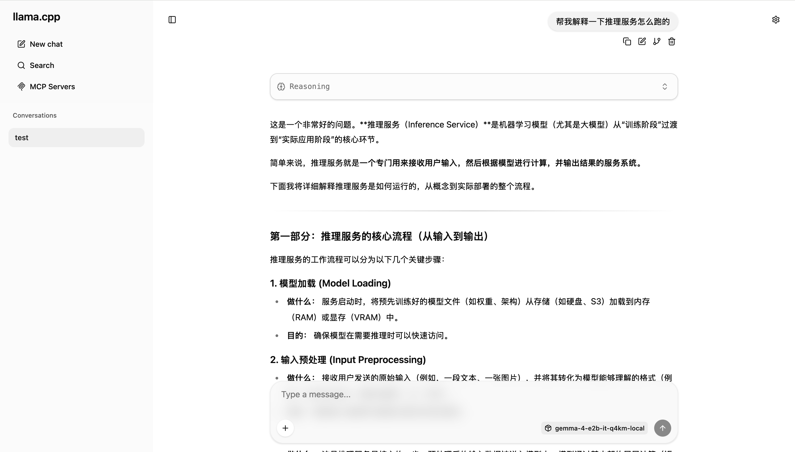

# Run Gemma 4 Anywhere

[English README](README.md)

这个仓库面向最终用户提供一套可直接运行 Gemma 4 推理的工程化方案，支持两种入口：

- Docker Compose 本地启动
- Kubernetes 一键部署

默认路径是 CPU 优先的 `llama.cpp + GGUF`，因为这是在笔记本、Docker 主机和 Kubernetes 集群之间最容易统一、也最容易真正跑起来的方案。

## 效果预览

下面是默认本地聊天界面的中文响应示例：



## 性能实测

除非单独说明，下面所有记录都使用同一套测试规格：

- 接口：`/completion`
- 方法：先做 1 次预热，再连续请求 5 次做统计
- 请求规格：使用 [scripts/benchmark_completion.py](scripts/benchmark_completion.py) 的默认 prompt，在当前模型上为 19 个 prompt token，`n_predict=128`，`temperature=0.1`，`ignore_eos=true`
- 镜像仓库：`ghcr.io/wilsonwu/run-gemma-4`

| 日期 | 宿主机 CPU | 运行方式 | 镜像 tag | 模型文件 | 平均生成吞吐 | 生成吞吐范围 | 平均 prompt 吞吐 | 平均生成耗时 | 备注 |
| --- | --- | --- | --- | --- | --- | --- | --- | --- | --- |
| 2026-04-09 | Apple M4 Pro | Docker Compose | `sha-d987db5` | `gemma-4-E2B-it-Q4_K_M.gguf` | `48.89 tokens/s` | `48.50-49.65 tokens/s` | `82.45 tokens/s` | `2618.5 ms` | 当前本地基线 |

这个结果应该视为“当前机器上的参考值”，不是通用承诺。CPU 型号、Docker 资源限制、prompt 长度、输出长度以及并发负载变化，都会直接影响吞吐。

如果你要复现或者追加一条新的机器记录，可以直接运行：

```bash
python3 scripts/benchmark_completion.py \
  --host-cpu "Apple M4 Pro" \
  --deployment "Docker Compose" \
  --image-tag sha-d987db5 \
  --model-file gemma-4-E2B-it-Q4_K_M.gguf \
  --notes "当前本地基线"
```

这个脚本会输出每轮的 prompt / generation 吞吐结果，最后再给出一行可以直接贴回上面表格的 Markdown 记录。

## 用户最终得到什么

- 一份已经发布到 GHCR 的镜像
- 一份可直接运行的 `compose.yaml`
- 一份可直接应用的标准 Kubernetes YAML 资源
- 支持断点续传和 SHA256 校验的模型下载逻辑
- 可配置的模型下载地址与代理参数

## 默认运行时

默认发布镜像聚焦在最实用的路径：

- 运行时：`llama.cpp`
- 模型格式：`GGUF`
- 默认模型源：ModelScope
- 默认模型文件：`gemma-4-E2B-it-Q4_K_M.gguf`

仓库现在刻意只保留这一条运行路径，不再维护 `transformers` 或 `ollama` 的旁支逻辑。

## 网络注意事项

这个项目里，镜像拉取和模型下载是故意分开的两件事：

- 容器镜像来源：`ghcr.io/wilsonwu/run-gemma-4`
- 模型文件来源：你在 `MODEL_URL` 里指定的地址

对于中国大陆用户：

- 默认 `MODEL_URL` 已经指向 ModelScope，因为它通常比 global 模型站更容易访问，也更稳定。
- 但 GHCR 在部分中国网络环境下仍然可能偏慢或不稳定。Compose 场景下，可以在 `.env` 里改 `IMAGE_REPO`；Kubernetes 场景下，可以直接把 [k8s/deployment.yaml](k8s/deployment.yaml) 里两个镜像地址改成你自己的镜像仓库或区域镜像。
- 如果你仍然要直接使用 GHCR，建议按实际网络环境设置 `HTTP_PROXY`、`HTTPS_PROXY`、`NO_PROXY`。

对于 global 用户：

- 直接从 GHCR 拉镜像通常就是最简单的路径。
- 如果 ModelScope 在你所在区域不是最快的模型源，可以在 `.env` 或 [k8s/configmap.yaml](k8s/configmap.yaml) 里把 `MODEL_URL` 改成离你更近的 GGUF 下载地址。
- 镜像来源和模型来源可以自由组合。比如镜像继续用 GHCR，但模型改成别的对象存储或公开下载源。

## Docker Compose 一键启动

1. 如果你已经在仓库目录里，可以直接运行交互式安装脚本：

```bash
bash install.sh
```

如果你不想先 clone 仓库，也可以直接在线执行：

```bash
curl -fsSL https://raw.githubusercontent.com/wilsonwu/run-gemma-4/main/install.sh | bash
```

如果你要指定安装目录，或者固定某个 tag / 分支，可以把参数放到 `bash -s --` 后面：

```bash
curl -fsSL https://raw.githubusercontent.com/wilsonwu/run-gemma-4/main/install.sh | \
  bash -s -- --install-dir "$HOME/run-gemma-4" --ref main
```

Windows PowerShell 下也可以直接运行：

```powershell
.\install.ps1
```

如果不想先 clone，也可以在线执行：

```powershell
irm https://raw.githubusercontent.com/wilsonwu/run-gemma-4/main/install.ps1 | iex
```

如果你更习惯 shell 环境，也可以在 Git Bash 或 WSL 中执行 `bash install.sh`，并确保 Docker Desktop 已经启动。

1. 脚本会自动检查 Docker、创建或更新 `.env`、引导输入通常需要人工确认的参数，然后直接启动 Docker Compose。在线模式下，它会先把 `compose.yaml` 和 `.env.example` 下载到本地安装目录，再继续走同一套交互流程。

1. 在进入参数输入前，安装器会探测 `GitHub`、`GHCR` 和 `ModelScope` 的可达性。如果判断出是“中国大陆风格”或类似受限网络，它会默认建议保留 ModelScope 模型地址、优先导入当前 shell 里的代理变量，并更早提示你是否要改成镜像 `IMAGE_REPO`。

1. 如果你仍然想手工方式启动，也可以先复制 `.env.example` 为 `.env`，检查 `MODEL_URL`、`MODEL_SHA256`、`IMAGE_TAG`，再执行：

```bash
docker compose up -d
```

1. 第一次启动时可以观察模型下载进度：

```bash
docker compose logs -f prepare-model
```

1. 发一个最小验证请求：

```bash
curl http://127.0.0.1:8080/completion \
  -H "Content-Type: application/json" \
  -d '{
    "prompt": "请只用一句中文回答。什么是 Kubernetes Service？\n回答：",
    "n_predict": 96,
    "temperature": 0.1,
    "stop": ["\n\n"]
  }'
```

说明：

- Compose 默认使用 `ghcr.io/wilsonwu/run-gemma-4:latest`
- 基础版 [compose.yaml](compose.yaml) 现在是独立可运行的，不要求本地先有完整仓库
- 仓库里额外提供了 [compose.override.yaml](compose.override.yaml)，所以你在仓库目录执行 `docker compose up` 时，仍然会自动 bind mount `docker/entrypoint.sh` 和 `docker/prepare-model.sh` 方便本地调试脚本
- `.env.example` 里保留了运行时代理参数
- 如果安装器检测到中国大陆风格或类似受限网络，会在你确认 `.env` 之前先给出 GHCR 相关的镜像源 / 代理建议
- 模型下载中断后，重新执行 `docker compose up` 会继续下载
- 如果 GGUF 文件损坏，脚本会自动删除并重新下载
- `install.sh` 还支持 `bash install.sh --yes` 直接接受默认值、`bash install.sh --no-start` 只生成 `.env` 不启动，以及 `bash install.sh --install-dir /path/to/run-gemma-4` 用于在线安装到指定目录

## Kubernetes 一键部署

Kubernetes 唯一入口现在就是 [k8s](k8s)。

1. 检查并编辑 [k8s/configmap.yaml](k8s/configmap.yaml)
2. 先创建命名空间：

```bash
kubectl apply -f k8s/namespace.yaml
```

1. 如果你的 GHCR 包是私有的，先创建镜像拉取凭证，并取消 [k8s/deployment.yaml](k8s/deployment.yaml) 里 `imagePullSecrets` 注释：

```bash
kubectl -n gemma-cpu create secret docker-registry ghcr-creds \
  --docker-server=ghcr.io \
  --docker-username=YOUR_GITHUB_USERNAME \
  --docker-password=YOUR_GHCR_TOKEN
```

1. 如果你要固定某个 release 镜像版本，把 [k8s/deployment.yaml](k8s/deployment.yaml) 里两个 `ghcr.io/wilsonwu/run-gemma-4:latest` 改成目标 tag。

1. 部署：

```bash
kubectl apply -f k8s/
```

1. 转发服务：

```bash
kubectl -n gemma-cpu port-forward svc/gemma-inference 8080:80
```

1. 发送同样的验证请求：

```bash
curl http://127.0.0.1:8080/completion \
  -H "Content-Type: application/json" \
  -d '{
    "prompt": "请只用一句中文回答。什么是 Kubernetes Service？\n回答：",
    "n_predict": 96,
    "temperature": 0.1,
    "stop": ["\n\n"]
  }'
```

说明：

- 这条 Kubernetes 路径已经不再依赖 Kustomize。
- 所有带命名空间的资源都已经显式写成 `gemma-cpu`，可以直接按标准 YAML 使用。

## 模型下载策略

这个项目专门按“不同网络环境”设计了模型准备参数。

核心参数：

- `MODEL_URL`：`llama.cpp` 路径下直接指定 GGUF 文件地址
- `MODEL_SHA256`：可选但强烈建议填写，用于完整性校验
- `HTTP_PROXY` / `HTTPS_PROXY` / `NO_PROXY`：代理设置

当前默认策略：

- GGUF 直链：ModelScope

这样拆分的原因很直接：

- 单个 GGUF 文件是这个仓库里最简单、最稳定的分发形式
- 直接改 `MODEL_URL` 就可以切换到任意镜像站、对象存储或者公司内部制品地址，而不需要改代码

## 镜像构建与发布

镜像发布由 GitHub Actions 驱动，工作流位于 [.github/workflows/build-image.yml](.github/workflows/build-image.yml)。

发布规则：

- 提交到 `main`：发布 `ghcr.io/wilsonwu/run-gemma-4:latest`
- 提交到 `main`：同时发布 `ghcr.io/wilsonwu/run-gemma-4:sha-<short-sha>`
- 打 Git Tag，例如 `v0.2.0`：发布 `ghcr.io/wilsonwu/run-gemma-4:v0.2.0`

默认发布平台：

- `linux/amd64`
- `linux/arm64`

只要 push 成功，镜像本身就已经进入 GitHub Packages，因为 GHCR 本身就是 GitHub 的容器包服务。现在工作流还会把本次实际发布的 tag 列表写到 GitHub Actions 的 job summary 里，这样你可以直接看到这次最新发布了哪些 tag。

工作流在 `workflow_dispatch` 下支持的可选参数：

- `http_proxy`
- `https_proxy`
- `no_proxy`
- `platforms`

另外，这些参数在 [.github/workflows/build-image.yml](.github/workflows/build-image.yml) 顶部也保留了可编辑默认值。这样 `main` / tag 的自动构建保持简单，同时又保留了代理和目标平台的可配置能力。

默认多架构发布后，Docker 在 Apple Silicon、ARM 服务器和 x86_64 主机上通常都会自动拉取匹配的镜像变体。所以本地 Compose 现在也不再默认强制指定 `linux/amd64`。

如果 `Build and push image` 这一步在登录成功后仍然报 GHCR `403 Forbidden`，通常说明“认证成功了，但当前 token 没有写入这个已有 package 的权限”。这在镜像最初是通过本地 PAT 手工 push 创建、而不是由当前仓库的 GitHub Actions 首次创建时很常见。

第一优先应该先检查 GitHub 上这个 package 的权限关系：

- 打开 `ghcr.io/wilsonwu/run-gemma-4` 对应 package 的设置页
- 确认当前仓库已经被加入这个 package 的 Actions 访问范围
- 如果这个 package 不是由当前仓库工作流首次创建的，就需要在 package 设置里重新关联或显式授权

建议做法：

- 配置仓库 secret `GHCR_TOKEN`：使用 classic PAT，至少包含 `write:packages` 和 `read:packages`
- 配置仓库 secret `GHCR_USERNAME`：填写这个 token 所属的 GitHub 用户名

当前工作流已经绑定到 GitHub Environment `run-gemma-4`。如果这个 environment 里存在 `GHCR_TOKEN`，登录步骤会自动优先使用这个 PAT；如果没有，才会回退到内置 `GITHUB_TOKEN`。

如果这个 PAT 就属于仓库 owner 账号，那现在不需要额外配置 `GHCR_USERNAME`。只有你后面想进一步自定义登录逻辑时，才需要再加它。

GitHub Actions 应该是默认的镜像发布路径。本地脚本 [docker/publish-ghcr.sh](docker/publish-ghcr.sh) 仍然保留，但只是可选辅助工具，参数也改成了基于环境变量显式传入，不再依赖自动探测本地代理。

## 仓库结构

- [Dockerfile](Dockerfile)：镜像定义
- [compose.yaml](compose.yaml)：只依赖已发布镜像即可运行的独立 Compose 入口
- [compose.override.yaml](compose.override.yaml)：仓库本地开发覆盖层，用于把调试脚本 bind mount 进容器
- [install.sh](install.sh)：既支持本地仓库执行，也支持 `curl | bash` 在线安装的交互式 Compose 启动脚本
- [install.ps1](install.ps1)：Windows PowerShell 包装入口，支持同一套本地 / 在线安装流程
- [.env.example](.env.example)：Compose 环境变量模板
- [docker/prepare-model.sh](docker/prepare-model.sh)：支持断点续传和校验的模型下载脚本
- [docker/entrypoint.sh](docker/entrypoint.sh)：运行时分发入口
- [k8s](k8s)：标准 Kubernetes YAML 资源
- [.github/workflows/build-image.yml](.github/workflows/build-image.yml)：CI 镜像发布流程

## License

见 [LICENSE](LICENSE)。
